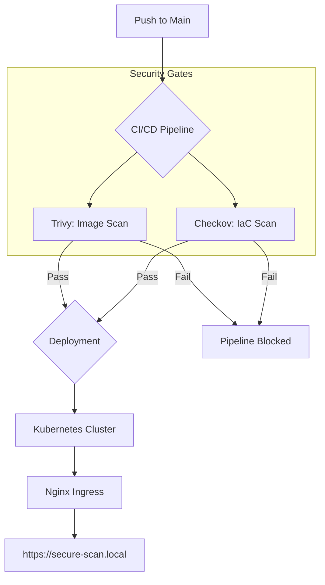
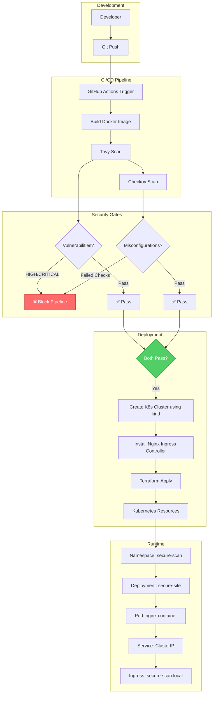
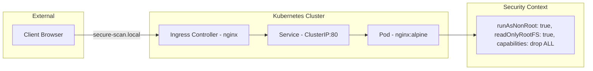
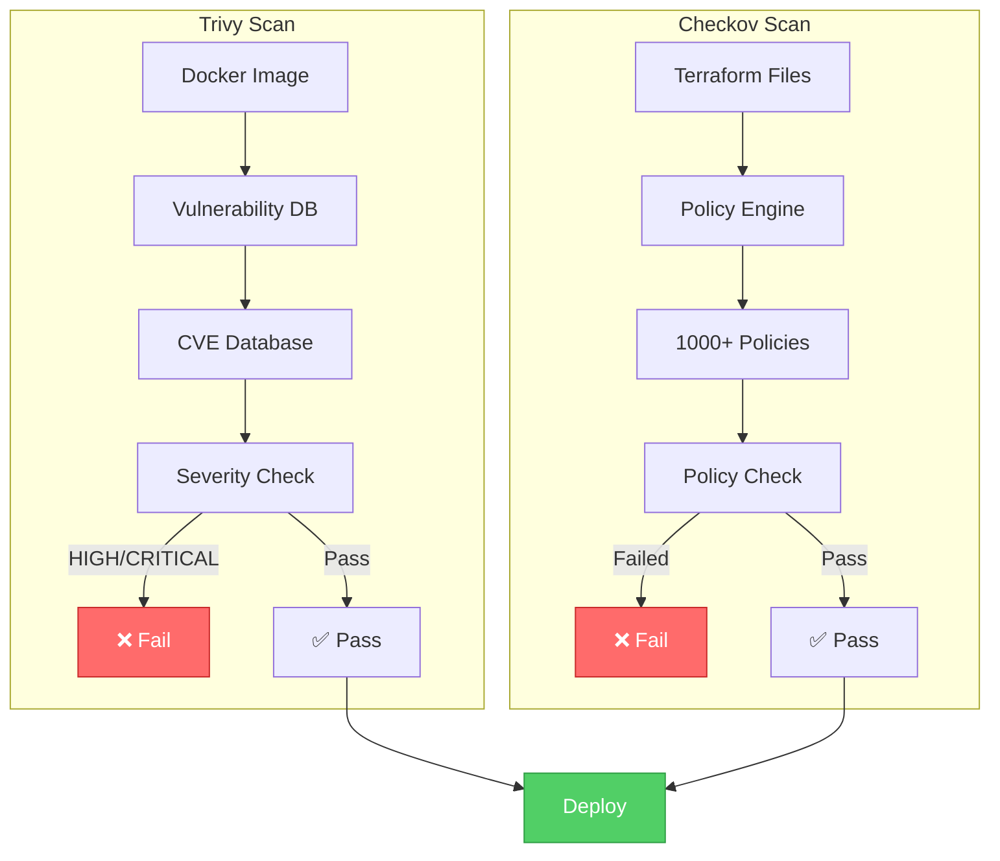
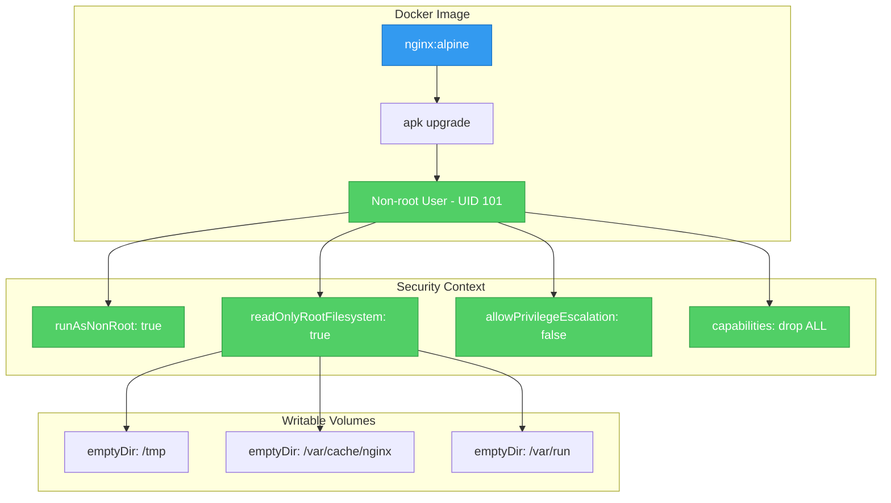
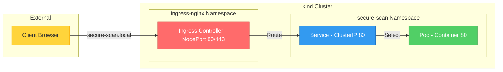
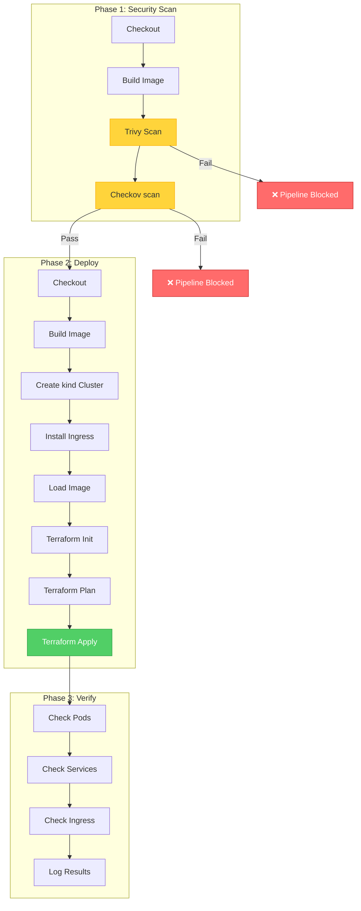

# Secure-Scan Static Site

A high-security static website deployment pipeline designed with a DevSecOps mindset. This project refuses to ship if any "High" or "Critical" security vulnerabilities are detected in the container image or infrastructure code.

##  Architecture

### CI/CD Pipeline Flow



### System Architecture



### Kubernetes Resource Flow



### Security Scanning Pipeline



### Container Security Architecture



### Network Architecture



### CI/CD Pipeline Architecture



##  Tech Stack
- **Site**: HTML5 + Vanilla CSS (Glassmorphism design)
- **Server**: Nginx (Alpine-based, non-root)
- **Infrastructure**: Terraform (Kubernetes Provider)
- **CI/CD**: GitHub Actions
- **Security Scanners**:
    - [Trivy](https://github.com/aquasecurity/trivy): Vulnerability scanner for container images.
    - [Checkov](https://github.com/bridgecrewio/checkov): Static analysis for infrastructure as code.
    - [kind](https://kind.sigs.k8s.io/): Kubernetes in Docker for CI/CD testing.

##  Security Features
### Container Hardening
- **Rootless**: Nginx runs as non-root user `nginx` (UID 101).
- **Immutable**: Pipeline pins images to specific SHAs/Digests.
- **Minimal**: Uses Alpine Linux to reduce attack surface.
- **Updated**: Automatic `apk upgrade` during build to mitigate CVEs.

### Infrastructure Hardening
- **Read-Only FS**: Containers run with a read-only root filesystem.
- **Resource Limits**: Enforced CPU and Memory quotas to prevent DoS.
- **Probes**: Configured Liveness and Readiness probes for health monitoring.
- **No Privilege**: Dropped all Linux capabilities and blocked privilege escalation.
- **Writable Volumes**: `emptyDir` volumes for `/tmp`, `/var/cache/nginx`, `/var/run` to support nginx runtime needs.

##  Getting Started

### Local Development
1. **Build the Image**:
   ```bash
   docker build -t secure-scan-site:latest .
   ```

2. **Run Security Scans**:
   ```bash
   # Image Scan
   docker run --rm -v /var/run/docker.sock:/var/run/docker.sock aquasec/trivy:latest image secure-scan-site:latest

   # Terraform Scan
   docker run --rm -v $(pwd)/terraform:/terraform bridgecrew/checkov -d /terraform
   ```

3. **Deploy Locally**:
   ```bash
   # Create kind cluster
   kind create cluster --name secure-scan-cluster
   
   # Load image
   kind load docker-image secure-scan-site:latest --name secure-scan-cluster
   
   # Install ingress
   kubectl apply -f https://raw.githubusercontent.com/kubernetes/ingress-nginx/main/deploy/static/provider/kind/deploy.yaml
   
   # Deploy with Terraform
   cd terraform
   terraform init
   terraform apply -auto-approve -var="image_name=secure-scan-site:latest"
   ```

4. **Access the Application**:
   ```bash
   # Port-forward to the deployment (quickest way to access)
   # Note: Container listens on port 8080 (non-root user can't bind to port 80)
   kubectl port-forward -n secure-scan deployment/secure-site 8080:8080 
   
   # Then open http://localhost:8080 in your browser
   ```

   ```bash
   # Or access via Ingress (requires local DNS or /etc/hosts entry)
   # Add to /etc/hosts: 127.0.0.1 secure-scan.local
   kubectl port-forward -n ingress-nginx service/ingress-nginx-controller 80:80 &
   
   # Then open http://secure-scan.local
   ```

### Image Pull Policy Note

When using `kind load docker-image`, the image exists locally in the kind cluster but not in a remote registry. The Terraform config uses `image_pull_policy = "Never"` to ensure Kubernetes uses the local image instead of trying to pull from Docker Hub.

### View Running Services

```bash
# Check all resources in the secure-scan namespace
kubectl get all -n secure-scan

# Check pods and their status
kubectl get pods -n secure-scan

# Check services
kubectl get svc -n secure-scan

# Check ingress
kubectl get ingress -n secure-scan

# View pod logs
kubectl logs -n secure-scan deployment/secure-site

# View pod logs (follow mode - real-time)
kubectl logs -n secure-scan deployment/secure-site -f

# Describe a pod for detailed status/events
kubectl describe pod -n secure-scan -l app=secure-site
```

### Destroy Resources (Cleanup)

**Important:** Always clean up when you're done to free resources!

```bash
# Step 1: Destroy Terraform-managed resources (namespace, deployment, service, ingress)
cd terraform
terraform destroy -auto-approve -var="image_name=secure-scan-site:latest"

# Step 2: Delete the entire kind cluster (removes everything including ingress-nginx namespace)
kind delete cluster --name secure-scan-cluster
```

> **Note:** `terraform destroy` removes the `secure-scan` namespace and all resources inside it.
> `kind delete cluster` removes the entire cluster including the `ingress-nginx` namespace.
> No need to manually delete namespaces with `kubectl` - Terraform and kind handle cleanup.

### Deployment
The project is configured to deploy via GitHub Actions. Only if all security gates pass will Terraform apply the changes to your Kubernetes cluster.

## 📚 Documentation

| Document | Description |
|----------|-------------|
| [Overview](docs/01-overview.md) | Project purpose, goals, and philosophy |
| [Architecture](docs/02-architecture.md) | System architecture with diagrams |
| [Security Scanning](docs/03-security-scanning.md) | Trivy and Checkov deep dive |
| [Terraform](docs/04-terraform.md) | Infrastructure as code explained |
| [Workflow](docs/05-workflow.md) | CI/CD pipeline breakdown |
| [Commands](docs/06-commands.md) | Complete command reference |
| [Troubleshooting](docs/07-troubleshooting.md) | Common issues and solutions |

