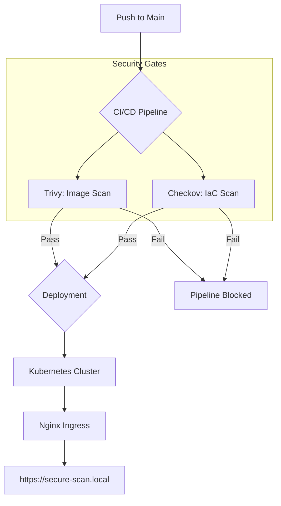

# Secure-Scan Static Site

A high-security static website deployment pipeline designed with a DevSecOps mindset. This project refuses to ship if any "High" or "Critical" security vulnerabilities are detected in the container image or infrastructure code.

## 🏗️ Architecture



## 🛠️ Tech Stack
- **Site**: HTML5 + Vanilla CSS (Glassmorphism design)
- **Server**: Nginx (Alpine-based, non-root)
- **Infrastructure**: Terraform (Kubernetes Provider)
- **CI/CD**: GitHub Actions
- **Security Scanners**:
    - [Trivy](https://github.com/aquasecurity/trivy): Vulnerability scanner for container images.
    - [Checkov](https://github.com/bridgecrewio/checkov): Static analysis for infrastructure as code.

## 🔒 Security Features
### Container Hardening
- **Rootless**: Nginx runs as non-root user `nginx` (UID 101).
- **Immutable**: Pipeline pins images to specific SHAs/Digests.
- **Minimal**: Uses Alpine Linux to reduce attack surface.
- **Updated**: Automatic `apk upgrade` during build to mitigate CVEs.

### Infrastructure Hardening
- **Read-Only FS**: Containers run with a read-only root filesystem.
- **Resource Limits**: Enforced CPU and Memory quotas to prevent DoS.
- **Probes**: Configured Liveness and Readiness probes for health monitoring.
- **No Privilege**: Dropped all Linux capabilities and blocked privilege escalation.

## 🚀 Getting Started

### Local Development
1. **Build the Image**:
   ```bash
   docker build -t secure-scan-site:latest .
   ```

2. **Run Security Scans**:
   ```bash
   # Image Scan
   docker run --rm -v /var/run/docker.sock:/var/run/docker.sock aquasec/trivy:latest image secure-scan-site:latest

   # Terraform Scan
   docker run --rm -v $(pwd)/terraform:/terraform bridgecrew/checkov -d /terraform
   ```

### Deployment
The project is configured to deploy via GitHub Actions. Only if all security gates pass will Terraform apply the changes to your Kubernetes cluster.

---
Built with DevSecOps by Antigravity 🚀
