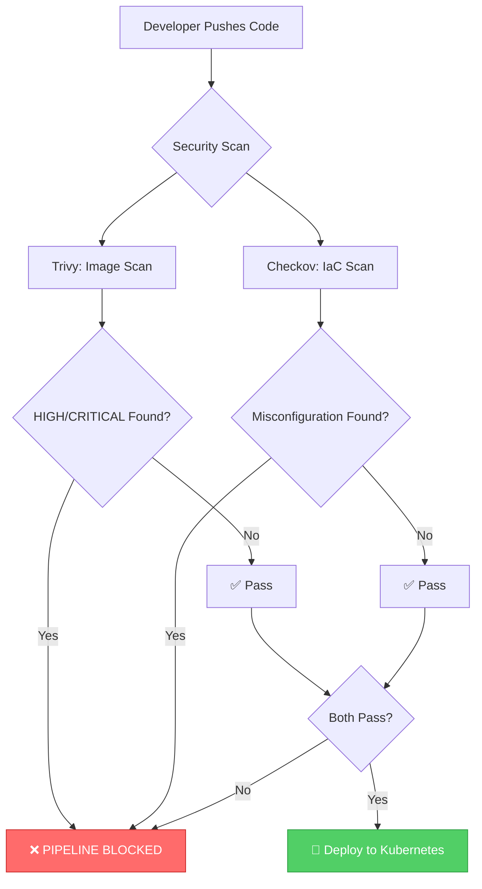

# Project Overview

## What is Secure-Scan Static Site?

The **Secure-Scan Static Site** is a DevSecOps project that demonstrates how to build a security-first CI/CD pipeline. The core principle is simple: **the pipeline refuses to ship code if security vulnerabilities are found**.

## Purpose

This project teaches:

| Concept | Description |
|---------|-------------|
| **DevSecOps Mindset** | Integrating security into every stage of development |
| **Pipeline Gates** | Blocking deployments when security issues are detected |
| **Image Scanning** | Detecting vulnerabilities in container images |
| **IaC Scanning** | Finding misconfigurations in infrastructure code |
| **Kubernetes Deployment** | Deploying applications with security best practices |

## Goals

### Primary Goals

1. **Security by Default**: No code reaches production without passing security checks
2. **Automation**: Security scanning is automatic, not manual
3. **Transparency**: Clear visibility into what's being checked and why
4. **Best Practices**: Following industry standards for container and Kubernetes security

### Learning Objectives

After working with this project, you will understand:

- How to set up a CI/CD pipeline with security gates
- How to use Trivy for container image vulnerability scanning
- How to use Checkov for Infrastructure-as-Code security scanning
- How to deploy applications to Kubernetes using Terraform
- How to configure Kubernetes Ingress for external access

## The "No-Ship" Philosophy



## Key Principle

> **"If it's not secure, it doesn't ship."**

This is the core DevSecOps principle. Security is not an afterthought—it's a gate that must be passed before any deployment.

## Project Structure

```
secure-scan-static-site/
├── .github/
│   └── workflows/
│       └── security-scan.yml    # CI/CD pipeline definition
├── site/
│   └── index.html               # Static website content
├── terraform/
│   ├── main.tf                  # Kubernetes resources
│   └── variables.tf             # Terraform variables
├── Dockerfile                   # Container image definition
├── README.md                    # Project documentation
└── doc/                         # Detailed documentation
    ├── 01-overview.md
    ├── 02-architecture.md
    ├── 03-security-scanning.md
    ├── 04-terraform.md
    ├── 05-workflow.md
    ├── 06-commands.md
    └── 07-troubleshooting.md
```

## Who Should Use This?

- **DevOps Engineers** learning to integrate security into pipelines
- **Security Engineers** understanding how to automate security checks
- **Developers** wanting to understand secure deployment practices
- **Students** learning DevSecOps principles

## Difficulty Level

**Moderate** - Requires basic understanding of:
- Docker and containerization
- Kubernetes concepts
- CI/CD pipelines
- Basic security concepts

## Next Steps

Continue reading the documentation:

1. [Architecture](02-architecture.md) - Understand the system design
2. [Security Scanning](03-security-scanning.md) - Learn about Trivy and Checkov
3. [Terraform](04-terraform.md) - Explore infrastructure as code
4. [Workflow](05-workflow.md) - Understand the CI/CD pipeline
5. [Commands](06-commands.md) - Reference for all commands
6. [Troubleshooting](07-troubleshooting.md) - Solve common issues