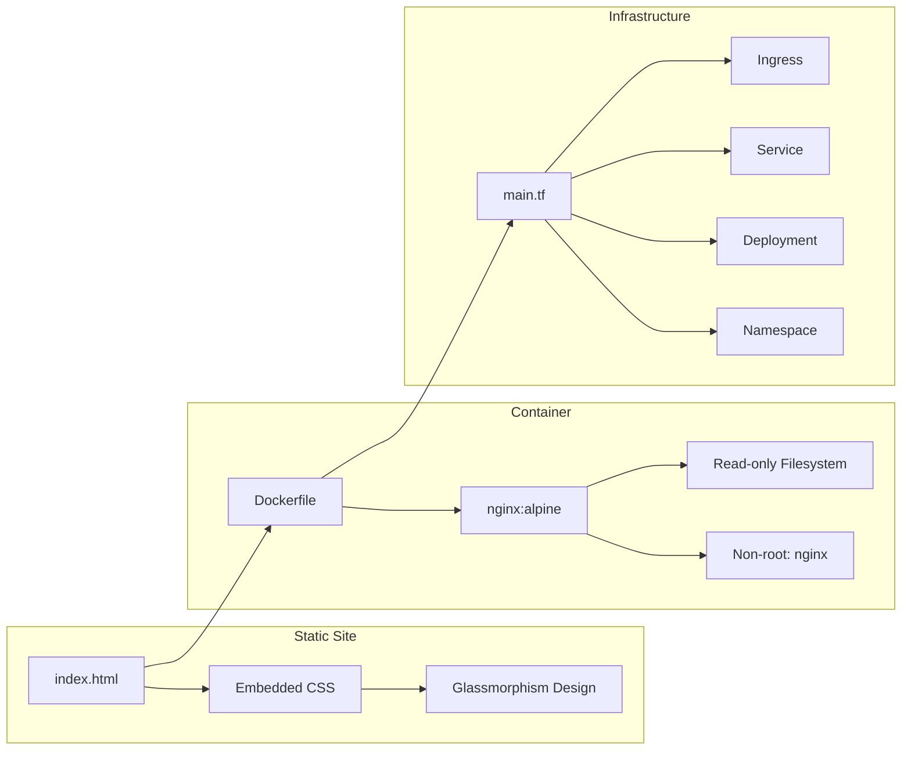
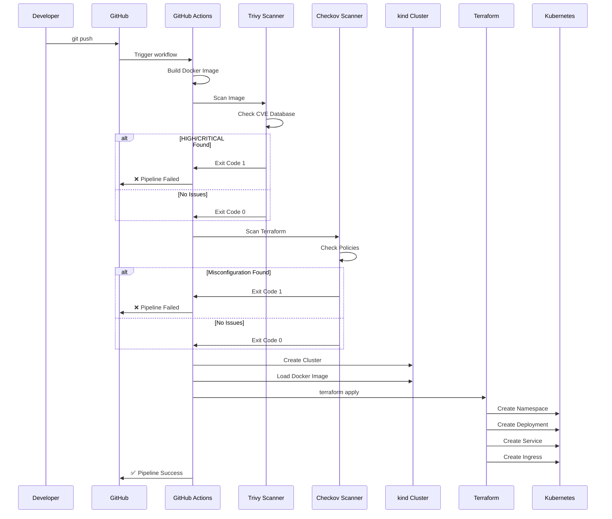
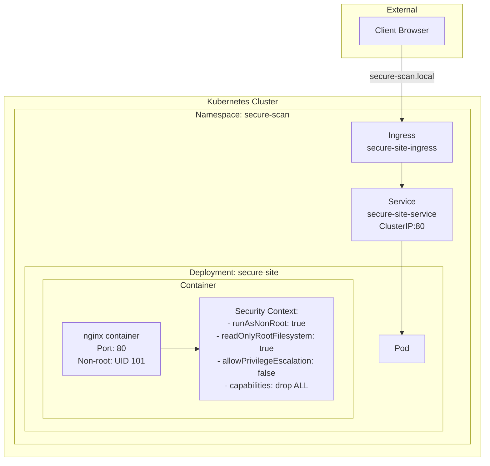
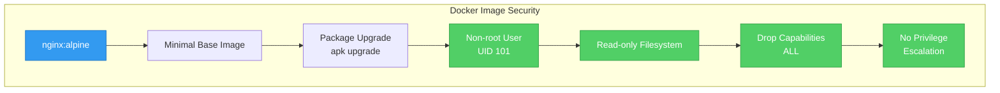
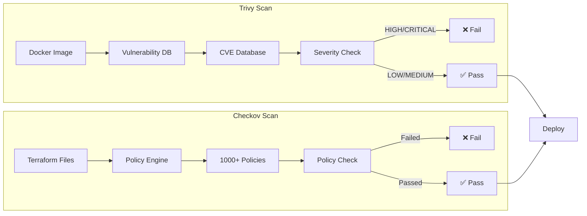
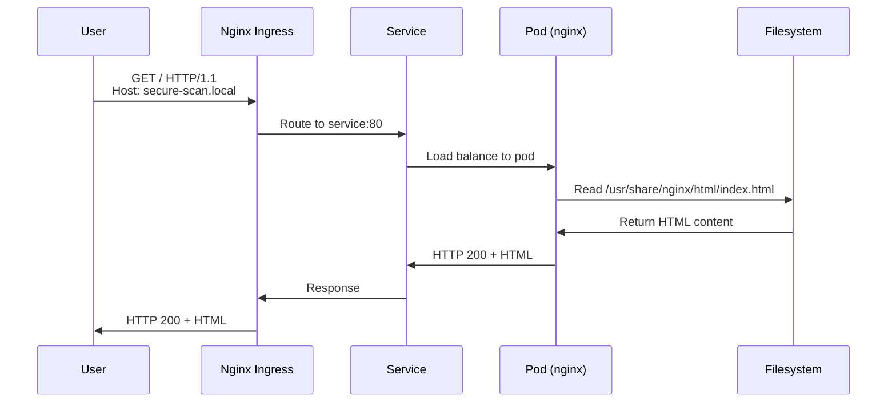
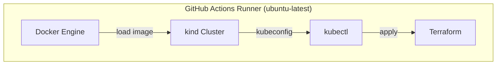
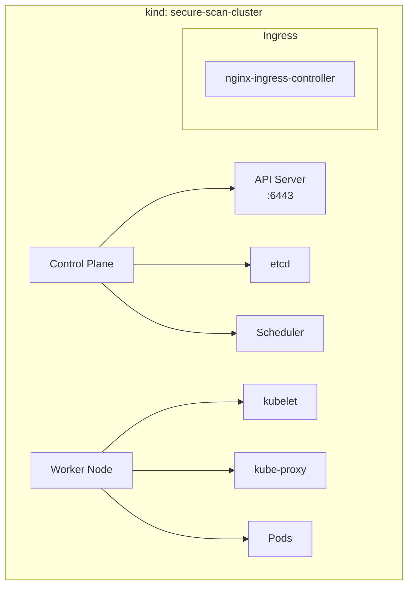

# Architecture

## System Overview

The Secure-Scan Static Site follows a **security-first architecture** where every component is designed with security gates.

```mermaid
flowchart TB
    subgraph "Development"
        DEV[Developer] --> PUSH[Git Push]
    end
    
    subgraph "CI/CD Pipeline"
        PUSH --> TRIGGER[GitHub Actions Trigger]
        TRIGGER --> BUILD[Build Docker Image]
        BUILD --> TRIVY[Trivy Scan]
        TRIVY --> CHECKOV[Checkov Scan]
    end
    
    subgraph "Security Gates"
        TRIVY --> GATE1{Vulnerabilities?}
        CHECKOV --> GATE2{Misconfigurations?}
        GATE1 -->|HIGH/CRITICAL| BLOCK[❌ Block Pipeline]
        GATE2 -->|Failed Checks| BLOCK
        GATE1 -->|Pass| PASS1[✅ Pass]
        GATE2 -->|Pass| PASS2[✅ Pass]
    end
    
    subgraph "Deployment"
        PASS1 --> DEPLOY{Both Pass?}
        PASS2 --> DEPLOY
        DEPLOY -->|Yes| KIND[Create K8s Cluster<br/>(kind)]
        KIND --> INGRESS[Install Ingress<br/>Controller]
        INGRESS --> TF[Terraform Apply]
        TF --> K8S[Kubernetes Resources]
    end
    
    subgraph "Runtime"
        K8S --> NS[Namespace: secure-scan]
        NS --> DEPLOYMENT[Deployment: secure-site]
        DEPLOYMENT --> POD[Pod: nginx container]
        POD --> SVC[Service: ClusterIP]
        SVC --> ING[Ingress: secure-scan.local]
    end
    
    style BLOCK fill:#ff6b6b,stroke:#c92a2a,color:#fff
    style DEPLOY fill:#51cf66,stroke:#2f9e44,color:#fff
```

## Component Architecture

### 1. Source Code Components



### 2. CI/CD Pipeline Flow



### 3. Kubernetes Resources



## Security Architecture

### Container Security



### Pipeline Security Gates



## Data Flow

### Request Flow



## Infrastructure Components

### GitHub Actions Runner



### kind Cluster



## File Structure Explained

| File | Purpose | Security Relevance |
|------|---------|-------------------|
| `Dockerfile` | Defines container image | Non-root user, read-only FS |
| `site/index.html` | Static website content | No server-side code = smaller attack surface |
| `terraform/main.tf` | Kubernetes resources | Security contexts, network policies |
| `terraform/variables.tf` | Input variables | Configurable image reference |
| `.github/workflows/security-scan.yml` | CI/CD pipeline | Security gates, automated scanning |

## Network Architecture

```mermaid
flowchart TB
    subgraph "External Network"
        CLIENT[Client]
    end
    
    subgraph "Kubernetes Network"
        INGRESS[Ingress Controller<br/>Port 80/443]
        SERVICE[Service<br/>ClusterIP Port 80]
        POD[Pod<br/>Container Port 80]
    end
    
    CLIENT -->|HTTP| INGRESS
    INGRESS -->|secure-scan.local| SERVICE
    SERVICE -->|ClusterIP| POD
    
    subgraph "Security Boundaries"
        BOUNDARY1[Network Policy<br/>(Future Enhancement)]
    end
```

## Next Steps

- [Security Scanning](03-security-scanning.md) - Learn about Trivy and Checkov
- [Terraform](04-terraform.md) - Understand infrastructure as code
- [Workflow](05-workflow.md) - Explore the CI/CD pipeline