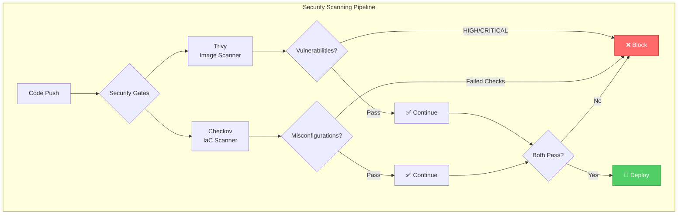
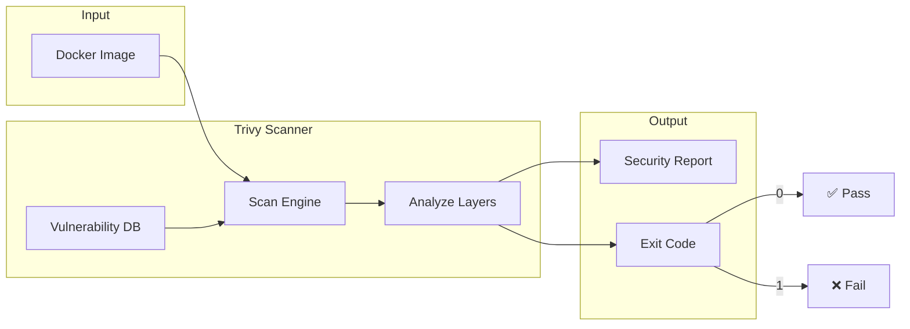
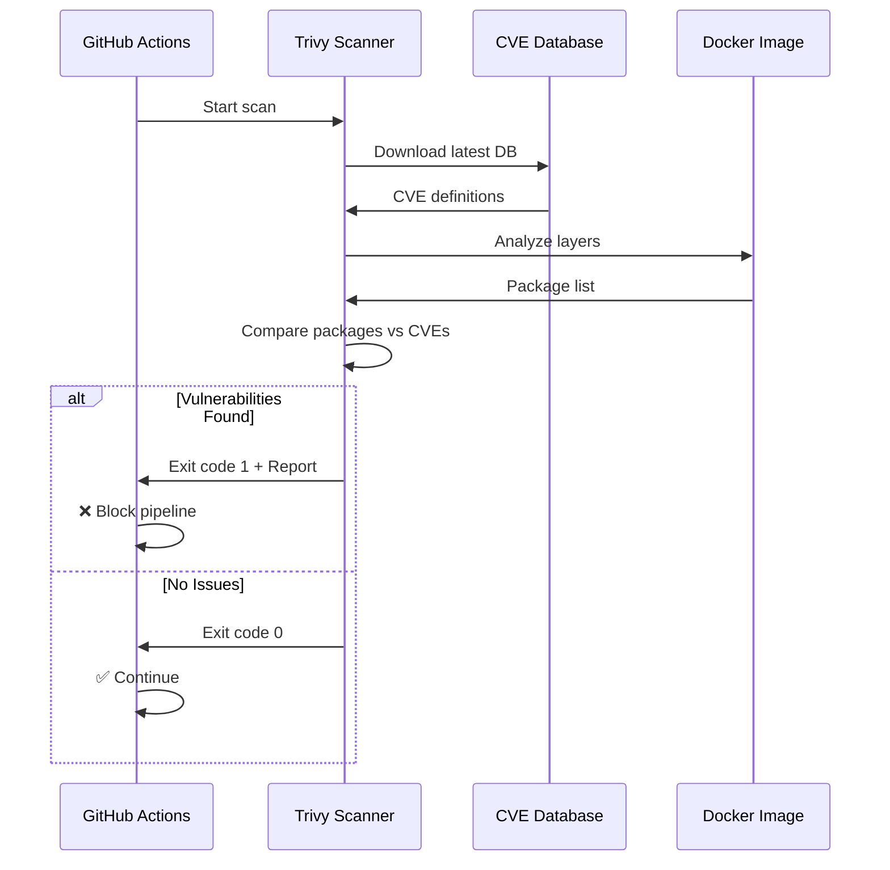
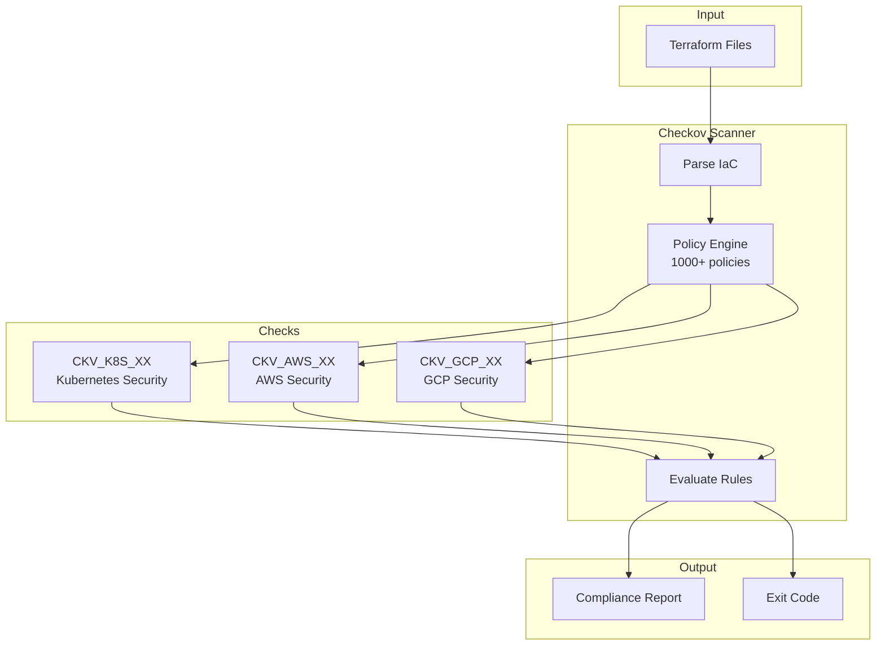
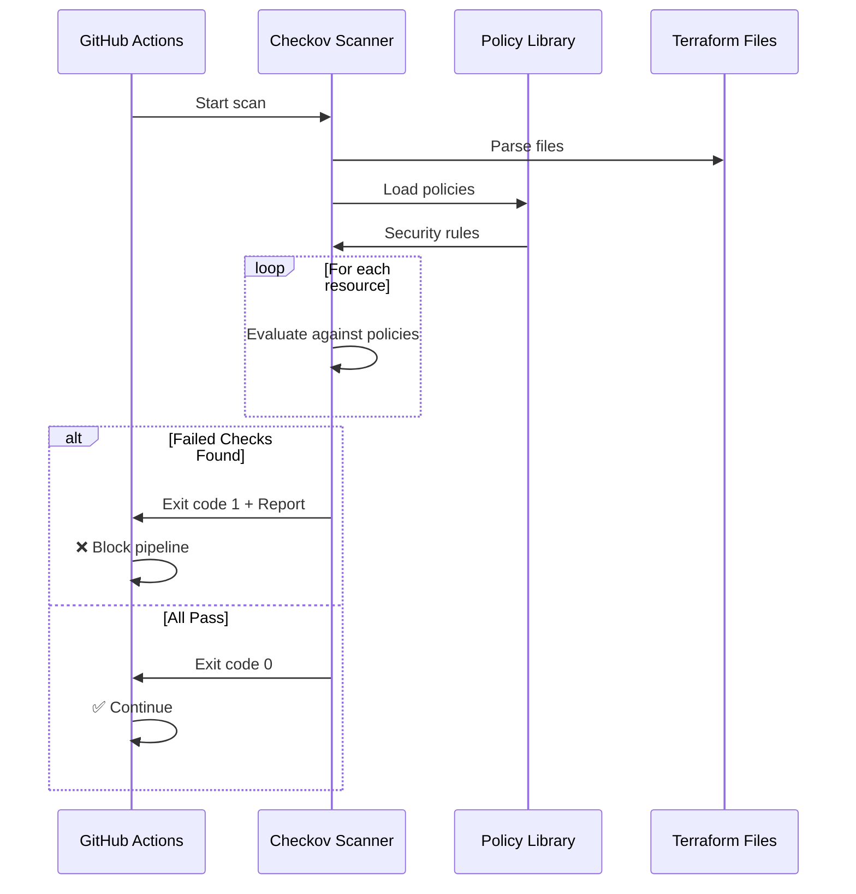
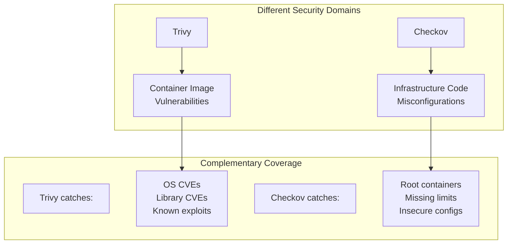
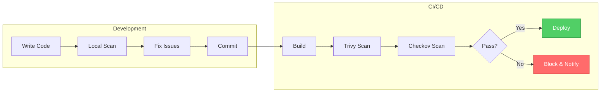

# Security Scanning

This document explains the two security scanning tools used in this project: **Trivy** and **Checkov**.

## Overview



---

## Trivy - Container Image Scanner

### What is Trivy?

**Trivy** (pronounced "trih-vee") is a comprehensive security scanner created by Aqua Security. It scans for:

- **OS vulnerabilities** (CVEs in Alpine, Ubuntu, etc.)
- **Language-specific vulnerabilities** (npm, pip, maven, etc.)
- **Secrets detection** (API keys, passwords in code)
- **Misconfigurations** (Dockerfile, Kubernetes, Terraform)

### How Trivy Works



### Trivy in Our Pipeline

```yaml
- name: Run Trivy vulnerability scanner
  uses: aquasecurity/trivy-action@master
  with:
    image-ref: 'secure-scan-site:${{ github.sha }}'
    format: 'table'
    exit-code: '1'
    ignore-unfixed: true
    vuln-type: 'os,library'
    severity: 'HIGH,CRITICAL'
```

| Parameter | Value | Purpose |
|-----------|-------|---------|
| `image-ref` | `secure-scan-site:${{ github.sha }}` | The Docker image to scan |
| `format` | `table` | Output format (table, json, sarif) |
| `exit-code` | `1` | Exit with error if vulnerabilities found |
| `ignore-unfixed` | `true` | Skip vulnerabilities with no fix available |
| `vuln-type` | `os,library` | Scan OS packages and language libraries |
| `severity` | `HIGH,CRITICAL` | Only report HIGH and CRITICAL severity |

### Trivy Scan Process



### Example Trivy Output

```
2024-01-15T10:30:00.000Z    INFO    Vulnerability scanning is enabled
2024-01-15T10:30:00.000Z    INFO    Detected OS: alpine
2024-01-15T10:30:00.000Z    INFO    Number of language-specific files: 0

alpine (linux/amd64)
=====================
Total: 0 (HIGH: 0, CRITICAL: 0)

nginx:alpine (nginx:alpine)
===========================
Total: 0 (HIGH: 0, CRITICAL: 0)
```

### Running Trivy Locally

```bash
# Scan a Docker image
docker run --rm -v /var/run/docker.sock:/var/run/docker.sock \
  aquasec/trivy:latest image secure-scan-site:latest

# Scan with JSON output
docker run --rm -v /var/run/docker.sock:/var/run/docker.sock \
  aquasec/trivy:latest image --format json secure-scan-site:latest

# Scan only HIGH and CRITICAL
docker run --rm -v /var/run/docker.sock:/var/run/docker.sock \
  aquasec/trivy:latest image --severity HIGH,CRITICAL secure-scan-site:latest
```

---

## Checkov - Infrastructure as Code Scanner

### What is Checkov?

**Checkov** is a static analysis tool for infrastructure-as-code created by Bridgecrew (now Palo Alto Networks). It scans:

- **Terraform** (AWS, Azure, GCP, Kubernetes)
- **CloudFormation**
- **Kubernetes manifests**
- **Dockerfiles**
- **ARM templates**

### How Checkov Works



### Checkov in Our Pipeline

```yaml
- name: Run Checkov action
  uses: bridgecrewio/checkov-action@master
  with:
    directory: terraform/
    framework: terraform
    soft_fail: false
    check: HIGH,CRITICAL
```

| Parameter | Value | Purpose |
|-----------|-------|---------|
| `directory` | `terraform/` | Directory containing IaC files |
| `framework` | `terraform` | Type of IaC to scan |
| `soft_fail` | `false` | Fail pipeline on issues |
| `check` | `HIGH,CRITICAL` | Only run high/critical checks |

### Key Kubernetes Security Checks

Checkov validates many security best practices for Kubernetes:

| Check ID | What it Checks |
|-----------|---------------|
| `CKV_K8S_10` | Container runs as non-root |
| `CKV_K8S_11` | Container doesn't allow privilege escalation |
| `CKV_K8S_12` | Container drops all capabilities |
| `CKV_K8S_14` | Container has read-only root filesystem |
| `CKV_K8S_15` | Container has resource limits defined |
| `CKV_K8S_21` | Default namespace is not used |
| `CKV_K8S_22` | Container image uses specific tag (not `:latest`) |
| `CKV_K8S_23` | Container has liveness probe configured |
| `CKV_K8S_24` | Container has readiness probe configured |

### Checkov Scan Process



### Example Checkov Output

```
       _               _              
      | |             | |             
   ___| |__   ___  ___| | _______  __
  / __| '_ \ / _ \/ __| |/ / _ \ \/ /
 | (__| | | |  __/ (__|   <  __/>  < 
  \___|_| |_|\___|\___|_|\_\___/_/\_\
  
By bridgecrew.io | version: 3.0.0

Terraform scan results:

Passed: 15
Failed: 0
Skipped: 0

Check: CKV_K8S_10: "Ensure container runs as non-root"
	PASSED for resource: kubernetes_deployment.site
	File: /terraform/main.tf:11-87

Check: CKV_K8S_11: "Ensure container doesn't allow privilege escalation"
	PASSED for resource: kubernetes_deployment.site
	File: /terraform/main.tf:11-87
```

### Running Checkov Locally

```bash
# Scan Terraform files
docker run --rm -v $(pwd)/terraform:/terraform bridgecrew/checkov -d /terraform

# Scan with JSON output
docker run --rm -v $(pwd)/terraform:/terraform bridgecrew/checkov -d /terraform --output json

# Scan only specific checks
docker run --rm -v $(pwd)/terraform:/terraform bridgecrew/checkov -d /terraform --check CKV_K8S_10,CKV_K8S_11
```

---

## Security Gate Logic

### Why Both Scanners?



### What Each Scanner Catches

| Issue Type | Trivy | Checkov |
|------------|-------|---------|
| CVE in Alpine packages | ✅ | ❌ |
| CVE in npm packages | ✅ | ❌ |
| Container running as root | ❌ | ✅ |
| Missing resource limits | ❌ | ✅ |
| Hardcoded secrets | ✅ | ✅ |
| Insecure Kubernetes config | ❌ | ✅ |
| Outdated base image | ✅ | ❌ |

---

## Best Practices

### For Trivy

1. **Run on every build**: Scan all images before deployment
2. **Block HIGH/CRITICAL**: Don't deploy with known vulnerabilities
3. **Update base images regularly**: Use `apk upgrade` in Dockerfile
4. **Pin image versions**: Use specific tags/digests

### For Checkov

1. **Scan before commit**: Run locally during development
2. **Fix all failed checks**: Don't skip security policies
3. **Keep policies updated**: New checks are added regularly
4. **Custom policies**: Add organization-specific rules

### Pipeline Integration



---

## Common Vulnerabilities Found

### Trivy Findings

| CVE | Package | Severity | Fix |
|-----|---------|----------|-----|
| CVE-2023-1234 | openssl | HIGH | Upgrade to 3.0.9 |
| CVE-2023-5678 | libssl | CRITICAL | Upgrade to 3.0.10 |

### Checkov Findings

| Check | Issue | Fix |
|-------|-------|-----|
| CKV_K8S_10 | Container runs as root | Add `run_as_non_root = true` |
| CKV_K8S_14 | Read-write filesystem | Add `read_only_root_filesystem = true` |
| CKV_K8S_15 | No resource limits | Add `resources { limits = {...} }` |

---

## Next Steps

- [Terraform](04-terraform.md) - Understand the infrastructure code
- [Workflow](05-workflow.md) - See how scans integrate into CI/CD
- [Commands](06-commands.md) - Learn how to run scans locally