# GitHub Actions Workflow

This document explains the CI/CD pipeline defined in [`.github/workflows/security-scan.yml`](../.github/workflows/security-scan.yml).

## Workflow Overview

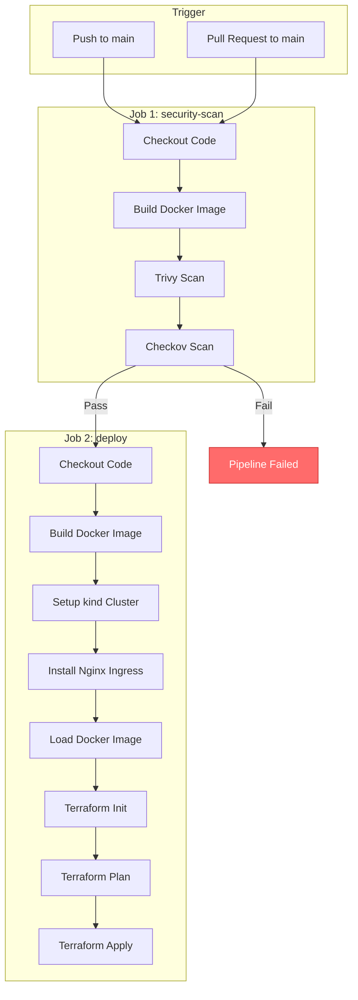

---

## Workflow Structure

The workflow is split into **two jobs**:

| Job | Purpose | Runs On |
|-----|---------|---------|
| `security-scan` | Build image and run security scans | ubuntu-latest |
| `deploy` | Deploy to Kubernetes cluster | ubuntu-latest |

### Job Dependency


The `deploy` job **only runs** if:
1. The `security-scan` job **passes**
2. The event is a **push to main** (not a PR)

---

## Triggers

```yaml
on:
  push:
    branches: [ main ]
  pull_request:
    branches: [ main ]
```

| Event | What Happens |
|-------|--------------|
| `push` to `main` | Both jobs run (scan + deploy) |
| `pull_request` to `main` | Only `security-scan` runs (no deploy) |

---

## Job 1: security-scan

### Step 1: Checkout Code

```yaml
- name: Checkout code
  uses: actions/checkout@v3
```

**Purpose**: Downloads the repository code to the runner.

### Step 2: Build Docker Image

```yaml
- name: Build Docker image
  run: docker build -t secure-scan-site:${{ github.sha }} .
```

**Purpose**: Builds the container image using the [`Dockerfile`](../Dockerfile).

**Image Tagging**: Uses the Git SHA (`${{ github.sha }}`) for unique identification.

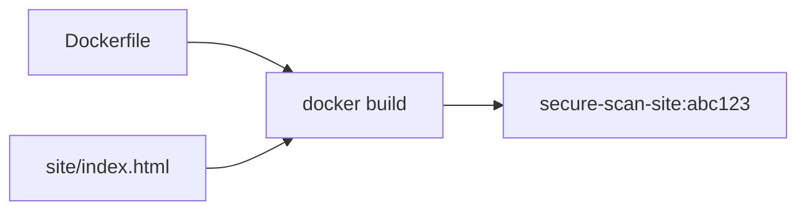

### Step 3: Trivy Scan

```yaml
- name: Run Trivy vulnerability scanner
  uses: aquasecurity/trivy-action@master
  with:
    image-ref: 'secure-scan-site:${{ github.sha }}'
    format: 'table'
    exit-code: '1'
    ignore-unfixed: true
    vuln-type: 'os,library'
    severity: 'HIGH,CRITICAL'
```

**Purpose**: Scans the Docker image for known vulnerabilities.

| Parameter | Value | Effect |
|-----------|-------|--------|
| `image-ref` | Built image | What to scan |
| `format` | `table` | Human-readable output |
| `exit-code` | `1` | Fail pipeline on findings |
| `ignore-unfixed` | `true` | Skip unpatched CVEs |
| `vuln-type` | `os,library` | Scan OS and app dependencies |
| `severity` | `HIGH,CRITICAL` | Only block on serious issues |

**What happens if vulnerabilities are found?**

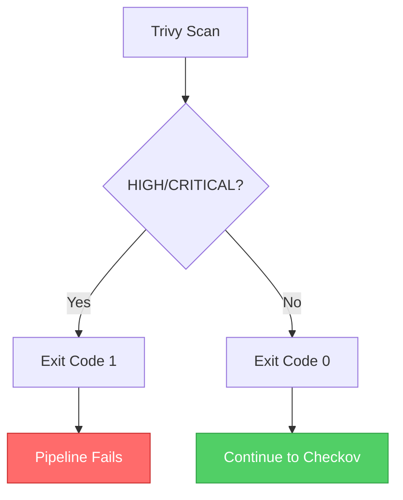

### Step 4: Checkov Scan

```yaml
- name: Run Checkov action
  uses: bridgecrewio/checkov-action@master
  with:
    directory: terraform/
    framework: terraform
    soft_fail: false
    check: HIGH,CRITICAL
```

**Purpose**: Scans Terraform files for security misconfigurations.

| Parameter | Value | Effect |
|-----------|-------|--------|
| `directory` | `terraform/` | What to scan |
| `framework` | `terraform` | Type of IaC |
| `soft_fail` | `false` | Hard fail on issues |
| `check` | `HIGH,CRITICAL` | Only critical checks |

**What happens if misconfigurations are found?**

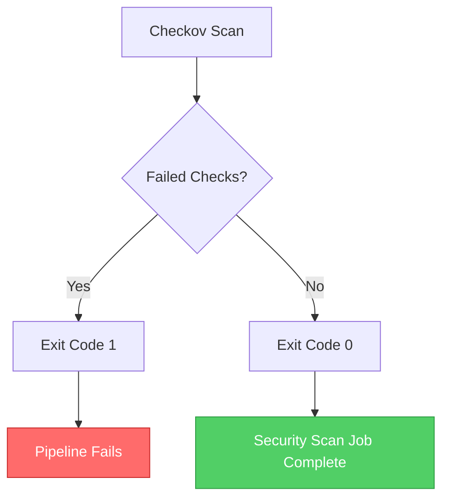

---

## Job 2: deploy

### Condition

```yaml
needs: security-scan
if: github.event_name == 'push' && github.ref == 'refs/heads/main'
```

**This job only runs when:**
1. `security-scan` job **passed**
2. Event is a **push** (not PR)
3. Branch is **main**

### Step 1: Checkout Code

```yaml
- name: Checkout code
  uses: actions/checkout@v3
```

### Step 2: Build Docker Image

```yaml
- name: Build Docker image
  run: docker build -t secure-scan-site:${{ github.sha }} .
```

### Step 3: Setup kind Cluster

```yaml
- name: Setup Kubernetes cluster (kind)
  uses: helm/kind-action@v1
  with:
    cluster_name: secure-scan-cluster
```

**Purpose**: Creates a local Kubernetes cluster using Docker.

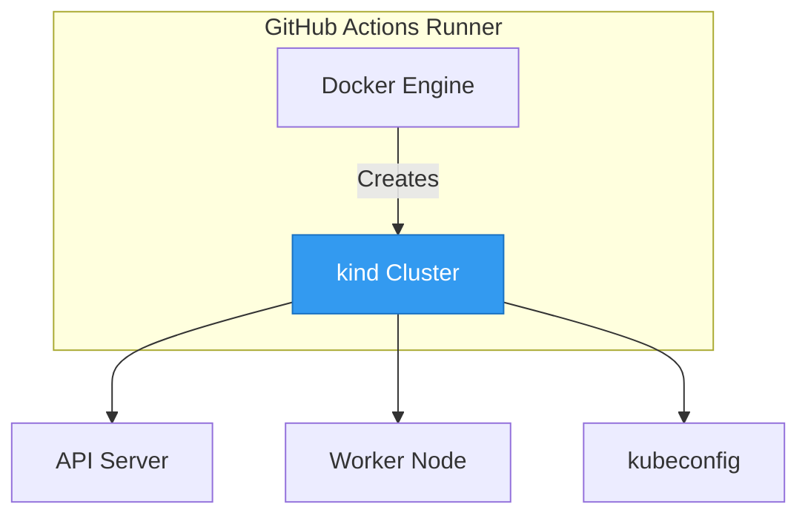

**What kind does:**
- Creates a Kubernetes cluster inside Docker containers
- Generates `~/.kube/config` automatically
- Sets context to `kind-secure-scan-cluster`

### Step 4: Install Nginx Ingress Controller

```yaml
- name: Install Nginx Ingress Controller
  run: |
    kubectl apply -f https://raw.githubusercontent.com/kubernetes/ingress-nginx/main/deploy/static/provider/kind/deploy.yaml
    kubectl wait --namespace ingress-nginx \
      --for=condition=ready pod \
      --selector=app.kubernetes.io/component=controller \
      --timeout=90s
```

**Purpose**: Installs the ingress controller needed for external access.

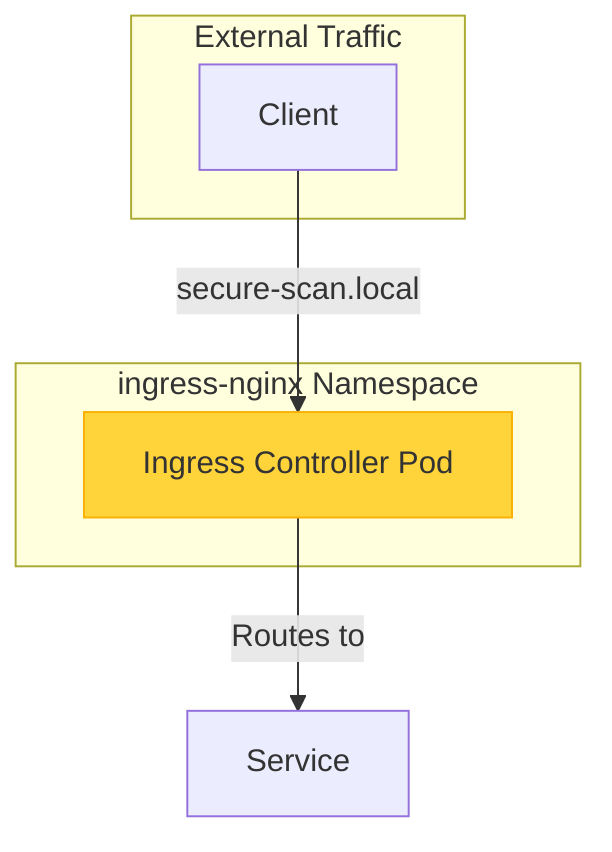

### Step 5: Load Docker Image

```yaml
- name: Load Docker image into kind
  run: kind load docker-image secure-scan-site:${{ github.sha }} --name secure-scan-cluster
```

**Purpose**: Makes the built Docker image available to the kind cluster.

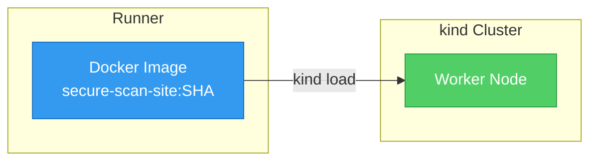

**Why this is needed:** kind runs Docker-in-Docker, so images built on the runner aren't automatically available inside the cluster.

### Step 6: Terraform Init

```yaml
- name: Setup Terraform
  uses: hashicorp/setup-terraform@v2

- name: Terraform Init
  run: terraform init
  working-directory: ./terraform
```

**Purpose**: Downloads required providers (kubernetes).

### Step 7: Terraform Plan

```yaml
- name: Terraform Plan
  run: terraform plan -var="image_name=secure-scan-site:${{ github.sha }}"
  working-directory: ./terraform
```

**Purpose**: Shows what changes will be made (dry run).

### Step 8: Terraform Apply

```yaml
- name: Terraform Apply
  run: terraform apply -auto-approve -var="image_name=secure-scan-site:${{ github.sha }}"
  working-directory: ./terraform
```

**Purpose**: Creates all Kubernetes resources.

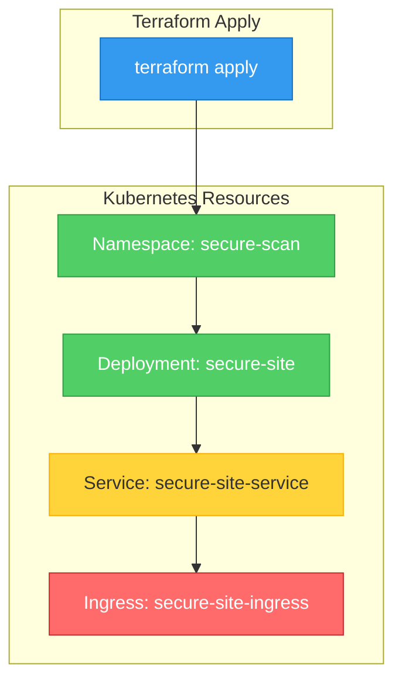

---

## Pipeline Flow Summary

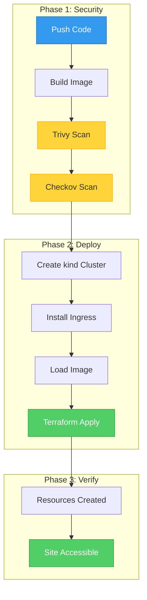

---

## Workflow Variables

| Variable | Source | Usage |
|----------|--------|-------|
| `${{ github.sha }}` | Git commit SHA | Image tag |
| `${{ github.ref }}` | Git ref (branch) | Condition check |
| `${{ github.event_name }}` | Event type | Condition check |

---

## Failure Scenarios

### Trivy Fails

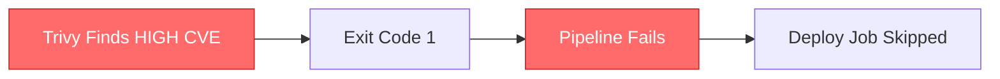

### Checkov Fails

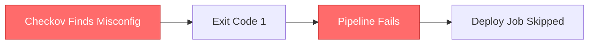

### Terraform Fails

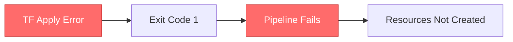

---

## Next Steps

- [Commands](06-commands.md) - Learn all CLI commands
- [Troubleshooting](07-troubleshooting.md) - Solve common issues