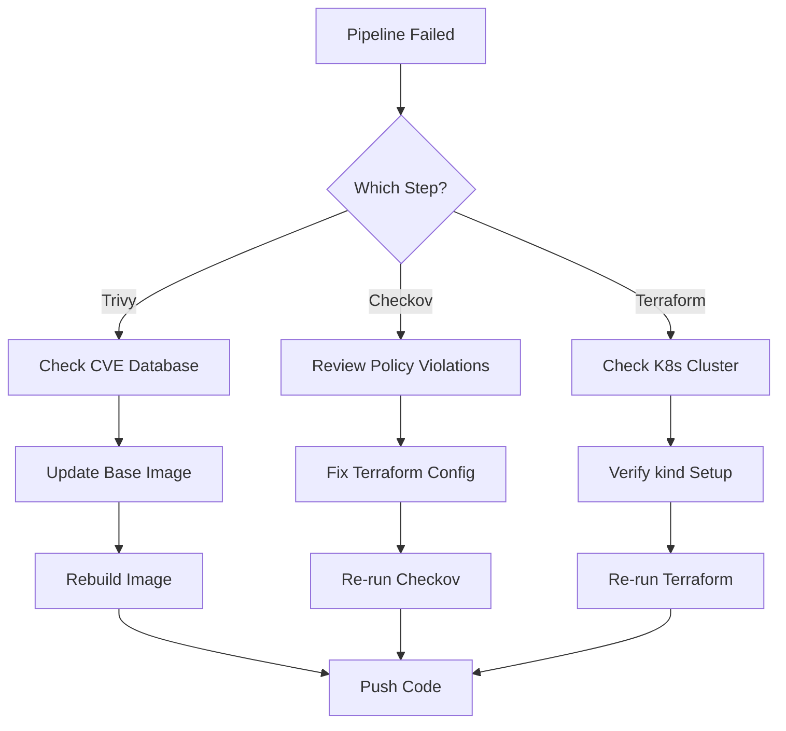

# Troubleshooting

This document covers common issues and their solutions when working with this project.

---

## Deployment Issues

### Pod Won't Start (0 Replicas Ready)

**Error:**
```
Error: Waiting for rollout to finish: 1 replicas wanted; 0 replicas Ready
```

**Cause:** The `read_only_root_filesystem = true` security setting prevents nginx from writing to directories it needs at runtime (`/tmp`, `/var/cache/nginx`, `/var/run`).

**Solution:** Add `emptyDir` volumes for writable paths in [`terraform/main.tf`](../terraform/main.tf):

```hcl
# Inside the container block:
volume_mount {
  name       = "tmp"
  mount_path = "/tmp"
}

volume_mount {
  name       = "nginx-cache"
  mount_path = "/var/cache/nginx"
}

volume_mount {
  name       = "nginx-run"
  mount_path = "/var/run"
}

# Inside the spec block (after container):
volume {
  name = "tmp"
  empty_dir {}
}

volume {
  name = "nginx-cache"
  empty_dir {}
}

volume {
  name = "nginx-run"
  empty_dir {}
}
```

**Why this works:** `emptyDir` volumes provide temporary writable storage that's mounted into the container, allowing nginx to write to these paths while keeping the root filesystem read-only.

---

## GitHub Actions Issues

### Pipeline Fails at Trivy Scan

**Error:**
```
Exit code 1
Found 5 HIGH severity vulnerabilities
```

**Cause:** The Docker image contains known vulnerabilities.

**Solution:**
```bash
# 1. Check which packages have vulnerabilities
docker run --rm -v /var/run/docker.sock:/var/run/docker.sock \
  aquasec/trivy:latest image --severity HIGH,CRITICAL secure-scan-site:latest

# 2. Update base image in Dockerfile
FROM nginx:alpine  # Use latest version

# 3. Add package upgrade
RUN apk update && apk upgrade --no-cache

# 4. Rebuild and test
docker build -t secure-scan-site:latest .
```

### Pipeline Fails at Checkov Scan

**Error:**
```
Failed checks:
CKV_K8S_10: Container runs as root
CKV_K8S_14: Read-only root filesystem not set
```

**Cause:** Terraform configuration doesn't meet security standards.

**Solution:**
```hcl
# In terraform/main.tf, add security context:
spec {
  container {
    security_context {
      run_as_non_root = true
      read_only_root_filesystem = true
      allow_privilege_escalation = false
      capabilities {
        drop = ["ALL"]
      }
    }
  }
}
```

### Pipeline Fails at Terraform Apply

**Error:**
```
Error: Post "http://localhost/api/v1/namespaces": dial tcp [::1]:80: connect: connection refused
```

**Cause:** No Kubernetes cluster is available.

**Solution:** Ensure the kind cluster setup step runs before Terraform:
```yaml
- name: Setup Kubernetes cluster (kind)
  uses: helm/kind-action@v1
  with:
    cluster_name: secure-scan-cluster
```

**Error:**
```
'config_path' refers to an invalid path: "/home/runner/.kube/config"
```

**Cause:** kind action didn't generate kubeconfig properly.

**Solution:** Add explicit context in Terraform provider:
```hcl
provider "kubernetes" {
  config_path    = pathexpand("~/.kube/config")
  config_context = "kind-secure-scan-cluster"
}
```

---

## Docker Issues

### Build Fails

**Error:**
```
failed to solve: failed to compute cache key
```

**Solution:**
```bash
# 1. Clean Docker cache
docker system prune -a

# 2. Rebuild without cache
docker build --no-cache -t secure-scan-site:latest .

# 3. Check Dockerfile syntax
docker build --progress=plain -t secure-scan-site:latest .
```

### Container Won't Start

**Error:**
```
Error: container create failed: permission denied
```

**Cause:** Running as non-root user without proper permissions.

**Solution:**
```dockerfile
# Ensure proper file ownership
RUN chown -R nginx:nginx /var/run/nginx.pid /var/cache/nginx /var/log/nginx /usr/share/nginx/html
USER nginx
```

---

## kind Issues

### Cluster Creation Fails

**Error:**
```
ERROR: failed to create cluster: failed to init node with kubeadm
```

**Solution:**
```bash
# 1. Delete existing cluster
kind delete cluster --name secure-scan-cluster

# 2. Check Docker is running
docker ps

# 3. Recreate cluster
kind create cluster --name secure-scan-cluster

# 4. Verify cluster
kubectl cluster-info
```

### Image Not Found in Cluster

**Error:**
```
Failed to pull image "secure-scan-site:latest": rpc error: code = NotFound
```

**Cause:** Image wasn't loaded into kind.

**Solution:**
```bash
# 1. Verify image exists in Docker
docker images | grep secure-scan-site

# 2. Load image into kind
kind load docker-image secure-scan-site:latest --name secure-scan-cluster

# 3. Verify image in cluster
docker exec -it secure-scan-cluster-worker crictl images | grep secure-scan-site
```

---

## kubectl Issues

### Connection Refused

**Error:**
```
The connection to the server localhost:8080 was refused
```

**Cause:** Wrong kubeconfig context.

**Solution:**
```bash
# 1. Check current context
kubectl config current-context

# 2. List available contexts
kubectl config get-contexts

# 3. Switch to kind context
kubectl config use-context kind-secure-scan-cluster

# 4. Verify connection
kubectl get nodes
```

### Resource Not Found

**Error:**
```
Error from server (NotFound): namespaces "secure-scan" not found
```

**Cause:** Terraform hasn't created the resources yet.

**Solution:**
```bash
# 1. Check if Terraform ran successfully
terraform state list

# 2. If not, run Terraform apply
cd terraform
terraform apply -auto-approve

# 3. Verify resources
kubectl get all -n secure-scan
```

---

## Terraform Issues

### Provider Not Initialized

**Error:**
```
Error: provider kubernetes: no configuration has been provided
```

**Solution:**
```bash
# 1. Initialize Terraform
cd terraform
terraform init

# 2. Verify provider installation
terraform providers

# 3. Check kubeconfig exists
ls -la ~/.kube/config
```

### State Corruption

**Error:**
```
Error: Invalid resource instance address
```

**Solution:**
```bash
# 1. Refresh state
terraform refresh

# 2. Re-import resources
terraform import kubernetes_namespace.secure_scan secure-scan

# 3. If all else fails, destroy and recreate
terraform destroy -auto-approve
terraform apply -auto-approve
```

### Plan Shows Unexpected Changes

**Error:**
```
Terraform will perform the following actions:
  ~ resource "kubernetes_deployment" "site" {
      ~ spec { ... }
    }
```

**Cause:** Configuration drift or manual changes.

**Solution:**
```bash
# 1. Review planned changes
terraform plan -detailed

# 2. If changes are correct, apply them
terraform apply

# 3. If changes are wrong, investigate manual modifications
kubectl get deployment secure-site -n secure-scan -o yaml
```

---

## Ingress Issues

### Ingress Controller Not Ready

**Error:**
```
Error from server (InternalError): error when creating "ingress.yaml": admission webhook "validate.nginx.ingress.kubernetes.io" denied the request
```

**Solution:**
```bash
# 1. Check ingress controller pods
kubectl get pods -n ingress-nginx

# 2. Wait for pods to be ready
kubectl wait --namespace ingress-nginx \
  --for=condition=ready pod \
  --selector=app.kubernetes.io/component=controller \
  --timeout=90s

# 3. If still failing, reinstall
kubectl delete -f https://raw.githubusercontent.com/kubernetes/ingress-nginx/main/deploy/static/provider/kind/deploy.yaml
kubectl apply -f https://raw.githubusercontent.com/kubernetes/ingress-nginx/main/deploy/static/provider/kind/deploy.yaml
```

### Ingress Not Routing

**Error:**
```
curl: (7) Failed to connect to secure-scan.local port 80: Connection refused
```

**Solution:**
```bash
# 1. Check ingress resource
kubectl get ingress -n secure-scan

# 2. Check ingress rules
kubectl describe ingress secure-site-ingress -n secure-scan

# 3. Verify service is running
kubectl get svc -n secure-scan

# 4. Test service directly
kubectl port-forward svc/secure-site-service 8080:80 -n secure-scan
curl http://localhost:8080
```

---

## Debugging Checklist

### When Pipeline Fails



### Quick Debug Commands

```bash
# 1. Check GitHub Actions logs
# Go to Actions tab > Workflow Run > Job > Step

# 2. Check kind cluster status
kind get clusters
kubectl cluster-info

# 3. Check all resources
kubectl get all -A

# 4. Check events
kubectl get events -n secure-scan --sort-by='.lastTimestamp'

# 5. Check pod logs
kubectl logs -l app=secure-site -n secure-scan
```

---

## Common Error Codes

| Error Code | Meaning | Solution |
|------------|---------|----------|
| `exit code 1` (Trivy) | Vulnerabilities found | Update base image or fix packages |
| `exit code 1` (Checkov) | Policy violations | Fix Terraform security config |
| `exit code 1` (Terraform) | Apply failed | Check cluster connectivity |
| `connection refused` | No API server | Verify kind cluster is running |
| `image not found` | Image not loaded | Run `kind load docker-image` |
| `namespace not found` | Resources not created | Run `terraform apply` |

---

## Getting Help

### Resources

1. **Trivy Documentation**: https://aquasecurity.github.io/trivy/
2. **Checkov Documentation**: https://www.checkov.io/
3. **kind Documentation**: https://kind.sigs.k8s.io/
4. **Terraform Kubernetes Provider**: https://registry.terraform.io/providers/hashicorp/kubernetes/latest/docs

### Logs Location

| Component | Log Location |
|-----------|--------------|
| GitHub Actions | Repository > Actions > Workflow Run |
| kind Cluster | `~/.kind/` directory |
| Kubernetes Pods | `kubectl logs <pod> -n <namespace>` |
| Terraform | Console output during `terraform apply` |

### Support Channels

- GitHub Issues (for this project)
- Kubernetes Slack (#kind channel)
- Terraform Community Forum