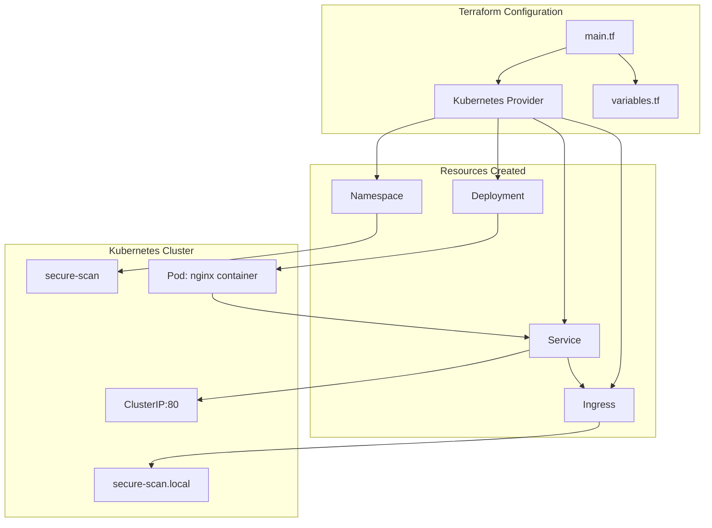
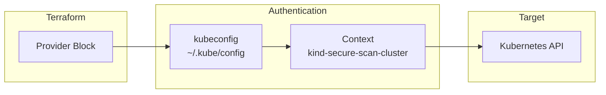
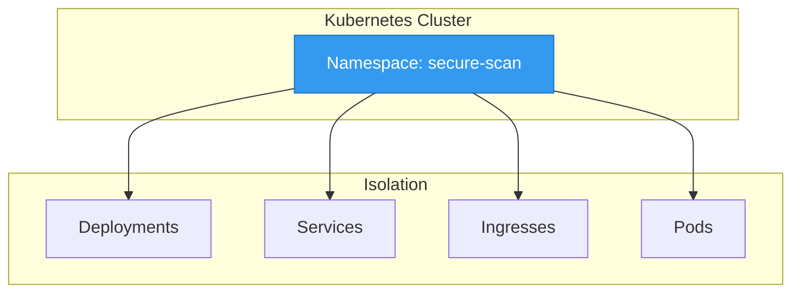
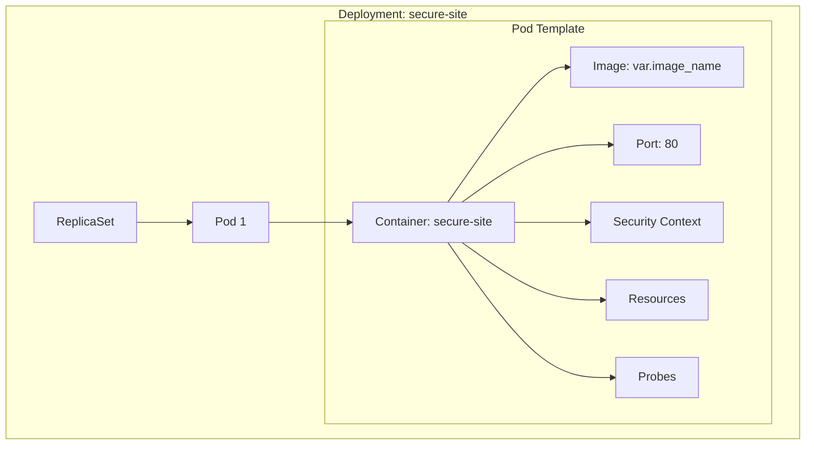
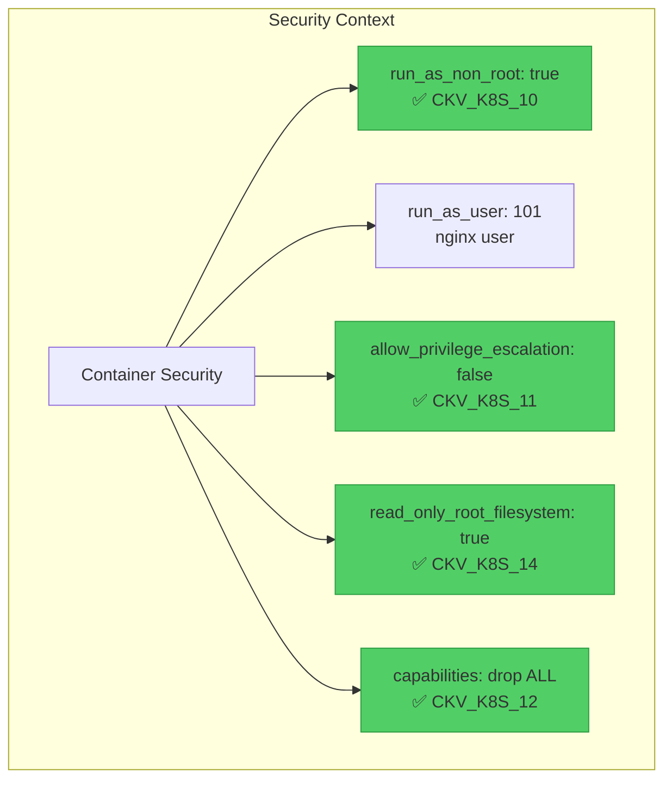
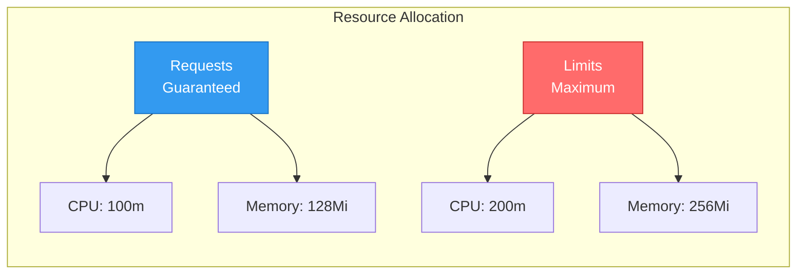
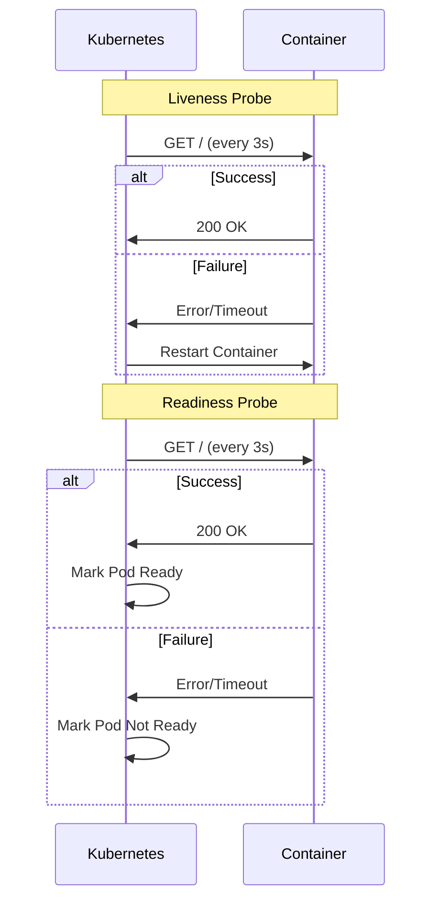
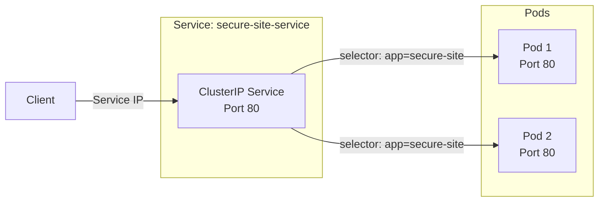
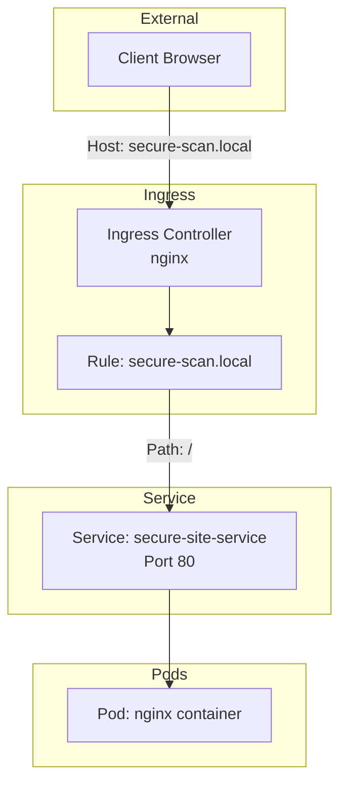
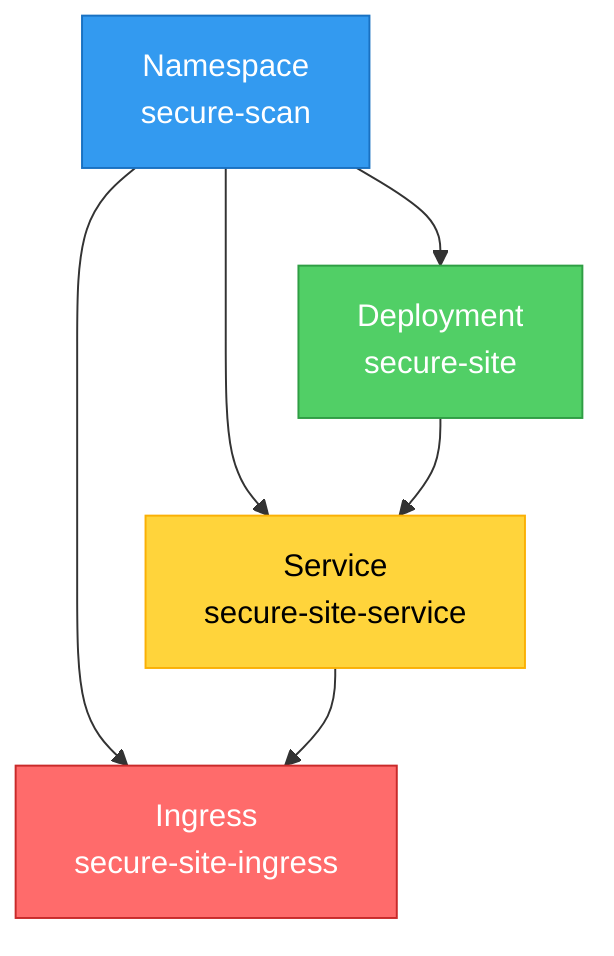

# Terraform Infrastructure

This document explains the Terraform configuration used to deploy the application to Kubernetes.

## Overview



---

## File Structure

```
terraform/
├── main.tf       # Main configuration with all resources
└── variables.tf  # Input variables
```

---

## Provider Configuration

### Code

```hcl
provider "kubernetes" {
  config_path    = pathexpand("~/.kube/config")
  config_context = "kind-secure-scan-cluster"
}
```

### Explanation



| Parameter | Value | Purpose |
|-----------|-------|---------|
| `config_path` | `~/.kube/config` | Path to kubeconfig file |
| `config_context` | `kind-secure-scan-cluster` | Specific context to use |

### Why These Settings?

1. **`config_path`**: Uses the default kubeconfig location
2. **`config_context`**: Explicitly sets the kind cluster context (avoids ambiguity when multiple clusters exist)
3. **`pathexpand()`**: Expands `~` to the home directory

---

## Variables

### File: `variables.tf`

```hcl
variable "image_name" {
  description = "The Docker image name to deploy"
  type        = string
  default     = "secure-scan-site:1.0.0@sha256:0e0dbff0379a2e524508add76f9f0d455be88133de61008b87b1e94e2426d5f7"
}
```

### Usage

```mermaid
flowchart LR
    subgraph "GitHub Actions"
        SHA[Git SHA]
        VAR[var="image_name=secure-scan-site:SHA"]
    end
    
    subgraph "Terraform"
        TF[terraform apply]
        V[variable "image_name"]
        R[resource kubernetes_deployment]
    end
    
    SHA --> VAR
    VAR --> TF
    TF --> V
    V --> R
```

| Attribute | Value | Purpose |
|-----------|-------|---------|
| `description` | Human-readable description | Documentation |
| `type` | `string` | Variable type |
| `default` | Default image | Used if not specified |

---

## Resources

### 1. Namespace

```hcl
resource "kubernetes_namespace_v1" "secure_scan" {
  metadata {
    name = "secure-scan"
  }
}
```



**Purpose**: Creates an isolated environment for all resources.

**Why a separate namespace?**
- **Isolation**: Separates resources from other workloads
- **Security**: Can apply different policies per namespace
- **Organization**: Easier to manage and clean up
- **Checkov**: Passes `CKV_K8S_21` (don't use default namespace)

---

### 2. Deployment

```hcl
resource "kubernetes_deployment" "site" {
  metadata {
    name      = "secure-site"
    namespace = kubernetes_namespace_v1.secure_scan.metadata[0].name
    labels = {
      app = "secure-site"
    }
  }

  spec {
    replicas = 1

    selector {
      match_labels = {
        app = "secure-site"
      }
    }

    template {
      metadata {
        labels = {
          app = "secure-site"
        }
      }

      spec {
        container {
          image             = var.image_name
          name              = "secure-site"
          image_pull_policy = "Never"

          port {
            container_port = 80
          }

          security_context {
            allow_privilege_escalation = false
            run_as_non_root            = true
            run_as_user                = 101
            read_only_root_filesystem  = true
            capabilities {
              drop = ["ALL"]
            }
          }

          resources {
            limits = {
              cpu    = "200m"
              memory = "256Mi"
            }
            requests = {
              cpu    = "100m"
              memory = "128Mi"
            }
          }

          liveness_probe {
            http_get {
              path = "/"
              port = 80
            }
            initial_delay_seconds = 3
            period_seconds        = 3
          }

          readiness_probe {
            http_get {
              path = "/"
              port = 80
            }
            initial_delay_seconds = 3
            period_seconds        = 3
          }

          volume_mount {
            name       = "tmp"
            mount_path = "/tmp"
          }

          volume_mount {
            name       = "nginx-cache"
            mount_path = "/var/cache/nginx"
          }

          volume_mount {
            name       = "nginx-run"
            mount_path = "/var/run"
          }
        }

        volume {
          name = "tmp"
          empty_dir {}
        }

        volume {
          name = "nginx-cache"
          empty_dir {}
        }

        volume {
          name = "nginx-run"
          empty_dir {}
        }
      }
    }
  }
}
```

#### Deployment Architecture



#### Security Context Breakdown



| Security Setting | Value | Checkov Check | Purpose |
|-----------------|-------|---------------|---------|
| `run_as_non_root` | `true` | CKV_K8S_10 | Prevents running as root user |
| `run_as_user` | `101` | - | Specific non-root UID (nginx) |
| `allow_privilege_escalation` | `false` | CKV_K8S_11 | Blocks gaining more privileges |
| `read_only_root_filesystem` | `true` | CKV_K8S_14 | Immutable container filesystem |
| `capabilities.drop` | `["ALL"]` | CKV_K8S_12 | Removes all Linux capabilities |
| `image_pull_policy` | `"Never"` | CKV_K8S_15 (skipped) | Uses pre-loaded kind image |

#### Volume Mounts for Read-Only Filesystem

When using `read_only_root_filesystem = true`, nginx needs writable directories for runtime operations. We add `emptyDir` volumes:

```hcl
# Volume mounts in container
volume_mount {
  name       = "tmp"
  mount_path = "/tmp"
}

volume_mount {
  name       = "nginx-cache"
  mount_path = "/var/cache/nginx"
}

volume_mount {
  name       = "nginx-run"
  mount_path = "/var/run"
}

# Volume definitions in spec
volume {
  name = "tmp"
  empty_dir {}
}

volume {
  name = "nginx-cache"
  empty_dir {}
}

volume {
  name = "nginx-run"
  empty_dir {}
}
```

**Why these directories are needed:**

| Mount Path | Purpose |
|------------|---------|
| `/tmp` | Temporary files for nginx worker processes |
| `/var/cache/nginx` | Nginx cache and proxy temp files |
| `/var/run` | PID file and runtime state |

#### Resource Limits



| Type | CPU | Memory | Purpose |
|------|-----|--------|---------|
| **Requests** | 100m | 128Mi | Guaranteed resources (scheduler uses this) |
| **Limits** | 200m | 256Mi | Maximum allowed (prevents runaway containers) |

**Why set limits?**
- Prevents DoS from runaway containers
- Ensures fair resource distribution
- Passes Checkov check `CKV_K8S_12` (Memory Limits)

#### Health Probes



| Probe | Purpose | Checkov Check |
|-------|---------|---------------|
| **Liveness** | Restart container if unhealthy | CKV_K8S_23 |
| **Readiness** | Remove from service if not ready | CKV_K8S_24 |

---

### 3. Service

```hcl
resource "kubernetes_service" "site" {
  metadata {
    name      = "secure-site-service"
    namespace = kubernetes_namespace_v1.secure_scan.metadata[0].name
  }
  
  spec {
    selector = {
      app = "secure-site"
    }
    port {
      port        = 80
      target_port = 80
    }
    type = "ClusterIP"
  }
}
```



| Setting | Value | Purpose |
|---------|-------|---------|
| `type` | `ClusterIP` | Internal cluster access only |
| `port` | `80` | Service port |
| `target_port` | `80` | Container port |
| `selector` | `app=secure-site` | Selects pods with this label |

**Why ClusterIP?**
- Internal service (not exposed externally)
- Ingress handles external traffic
- More secure (no direct external access)

---

### 4. Ingress

```hcl
resource "kubernetes_ingress_v1" "site" {
  metadata {
    name      = "secure-site-ingress"
    namespace = kubernetes_namespace_v1.secure_scan.metadata[0].name
  }

  spec {
    ingress_class_name = "nginx"

    rule {
      host = "secure-scan.local"
      http {
        path {
          path = "/"
          path_type = "Prefix"
          backend {
            service {
              name = kubernetes_service.site.metadata[0].name
              port {
                number = 80
              }
            }
          }
        }
      }
    }
  }
}
```



| Setting | Value | Purpose |
|---------|-------|---------|
| `ingress_class_name` | `nginx` | Uses nginx ingress controller |
| `host` | `secure-scan.local` | Domain name for routing |
| `path` | `/` | Match all paths |
| `path_type` | `Prefix` | Prefix matching |

**Why Ingress?**
- Single entry point for multiple services
- SSL/TLS termination (can be added)
- URL-based routing
- Virtual hosting

---

## Resource Dependencies



Terraform automatically handles dependencies:
1. **Namespace** must exist first
2. **Deployment** and **Service** depend on Namespace
3. **Ingress** depends on Service

---

## Applying Terraform

### Local Development

```bash
# Initialize Terraform
cd terraform
terraform init

# Plan changes
terraform plan -var="image_name=secure-scan-site:latest"

# Apply changes
terraform apply -var="image_name=secure-scan-site:latest"

# Destroy resources
terraform destroy
```

### In CI/CD Pipeline

```yaml
- name: Terraform Init
  run: terraform init
  working-directory: ./terraform

- name: Terraform Plan
  run: terraform plan -var="image_name=secure-scan-site:${{ github.sha }}"
  working-directory: ./terraform

- name: Terraform Apply
  run: terraform apply -auto-approve -var="image_name=secure-scan-site:${{ github.sha }}"
  working-directory: ./terraform
```

---

## Checkov Compliance

All resources pass the following Checkov checks:

| Check ID | Description | Status |
|----------|-------------|--------|
| CKV_K8S_10 | CPU requests should be set | ✅ Pass |
| CKV_K8S_11 | CPU Limits should be set | ✅ Pass |
| CKV_K8S_12 | Memory Limits should be set | ✅ Pass |
| CKV_K8S_14 | Image Tag should be fixed - not latest or blank | ✅ Pass |
| CKV_K8S_15 | Image Pull Policy should be Always | ⏭️ Skipped (see note below) |
| CKV_K8S_21 | The default namespace should not be used | ✅ Pass |
| CKV_K8S_23 | Liveness probe configured | ✅ Pass |
| CKV_K8S_24 | Readiness probe configured | ✅ Pass |

### Why CKV_K8S_15 is Skipped

The `CKV_K8S_15` check expects `imagePullPolicy: Always`, but our architecture uses `imagePullPolicy: Never` because:

1. **Pre-loaded Images**: The Docker image is built in GitHub Actions and loaded into the kind cluster using `kind load docker-image`
2. **No Remote Registry**: The image doesn't exist in Docker Hub or any remote registry
3. **Security**: The image is already scanned by Trivy before being loaded into kind
4. **Efficiency**: Avoids unnecessary pull attempts that would fail anyway

This skip is configured in `.github/workflows/security-scan.yml` by removing `CKV_K8S_15` from the check list.

---

## Next Steps

- [Workflow](05-workflow.md) - See how Terraform integrates into CI/CD
- [Commands](06-commands.md) - Learn Terraform commands
- [Troubleshooting](07-troubleshooting.md) - Solve common Terraform issues